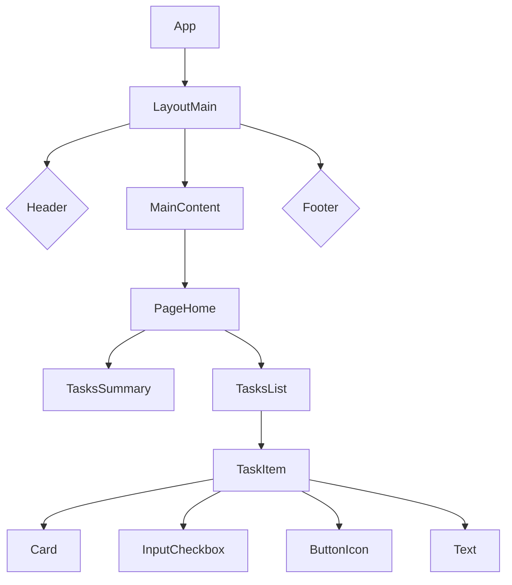

# ToDo List - Gerenciador de Tarefas

<br />

<div align="center">
    
</div>

<br />

<div align="center">
  
  
  
  
</div>

<br />

## 1. Descrição

O **ToDo List** é uma aplicação web moderna e interativa desenvolvida para simplificar o gerenciamento de tarefas diárias. Com uma interface limpa e focada na usabilidade, a ferramenta permite que os usuários organizem suas atividades de forma eficiente, acompanhem seu progresso e mantenham o foco em suas prioridades. Este projeto foi criado com fins educacionais para aplicar conceitos avançados de desenvolvimento front-end com React, TypeScript e Vite.

Entre os principais recursos da aplicação, destacam-se:

1.  Criação, leitura, atualização e exclusão (CRUD) de tarefas.
2.  Interface responsiva e amigável para uma experiência de usuário agradável.
3.  Feedback visual imediato para ações como adicionar, editar e concluir tarefas.
4.  Persistência de dados no navegador utilizando Local Storage.

<br />

## 2. Sobre esta Aplicação

O **ToDo List** foi desenvolvido utilizando **React** e **TypeScript**, com o ambiente de desenvolvimento **Vite** para garantir performance e agilidade. A aplicação segue as melhores práticas de componentização e gerenciamento de estado, oferecendo uma experiência fluida e reativa.

<br />

### 2.1. Principais funcionalidades da Aplicação

1.  **Gerenciamento de Tarefas:**
    * **Adicionar**: Criação de novas tarefas de forma rápida e intuitiva.
    * **Editar**: Modificação do título de tarefas existentes.
    * **Excluir**: Remoção de tarefas que não são mais necessárias.
    * **Marcar como Concluída**: Alternar o status da tarefa entre pendente e concluída.
2.  **Acompanhamento Visual:**
    * **Contadores Dinâmicos**: Visualização em tempo real do número de tarefas criadas e concluídas.
    * **Indicadores de Carregamento**: Animações de "loading" e "handling" que fornecem feedback sobre operações assíncronas (simuladas).
3.  **Persistência de Dados:**
    * As tarefas são salvas no **Local Storage** do navegador, garantindo que os dados não sejam perdidos ao recarregar a página.

<br />

## 3. Estrutura do Projeto (Componentes)

O projeto é estruturado em componentes reutilizáveis. Abaixo, um diagrama simplificado da hierarquia dos principais componentes.



<br/>

## 4. Tecnologias Utilizadas

| Item | Descrição |
| --- | --- |
| **Biblioteca** | [React](https://react.dev/) |
| **Linguagem** | [TypeScript](https://www.typescriptlang.org/) |
| **Build Tool** | [Vite](https://vitejs.dev/) |
| **Estilização** | [Tailwind CSS](https://tailwindcss.com/) |
| **Roteamento** | [React Router](https://reactrouter.com/) |
| **Persistência** | [use-local-storage](https://www.npmjs.com/package/use-local-storage) |
| **Hospedagem** | [Vercel](https://vercel.com/) |

<br/>

## 5. Como Testar o Projeto

### 5.1. Teste Online
A maneira mais fácil de testar é acessando a versão hospedada na Vercel:

> **Link do Projeto: [https://to-do-tau-ecru.vercel.app/](https://to-do-tau-ecru.vercel.app/)**

### 5.2. Executando Localmente
Para executar o projeto em seu ambiente local, siga os passos abaixo:

1.  **Clone o repositório:**
    ```bash
    git clone [https://github.com/Brunogodoy2911/ToDo.git](https://github.com/Brunogodoy2911/ToDo.git)
    cd ToDo
    ```
2.  **Instale as dependências:**
    ```bash
    npm install
    ```
3.  **Execute a aplicação em modo de desenvolvimento:**
    ```bash
    npm run dev
    ```
4.  Abra seu navegador e acesse `http://localhost:5173` (ou a porta indicada no terminal).

<br/>

## 6. Contribuição
Este repositório é parte de um projeto de portfólio, mas contribuições são sempre bem-vindas! Caso tenha sugestões, correções ou melhorias, fique à vontade para:

-   Criar uma **issue** para discutir a mudança que você gostaria de fazer.
-   Enviar um **pull request** com suas melhorias.
-   Compartilhar com colegas que estejam aprendendo React e desenvolvimento front-end!

<br/>

## 7. Contato
Desenvolvido por **Bruno Godoy**

-   **GitHub:** [Brunogodoy2911](https://github.com/Brunogodoy2911)
-   **LinkedIn:** [brunogodoydev](https://www.linkedin.com/in/brunogodoydev/)
